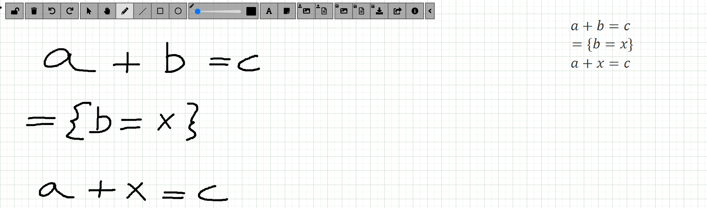

# Tablet PC Tool for Handwriting Recognition of Calculational Mathematics

This project explores the **recognition** of **handwritten mathematical expressions** with a focus on calculational proofs, integrating a [whiteboard interface](https://github.com/nunores/whiteboard) with an extended version of [Seshat](https://github.com/nunores/seshat), an open-source handwritten math recognizer.

It supports freehand **writing using pen-based devices** (such as Tablet PCs), enabling users to write proofs in the Calculational Method style. The ultimate goal is to facilitate intuitive **digital proof** **creation**, **validation**, and **interaction** — helping students, educators, and researchers work more naturally with mathematics.

Developed as part of my Master's Thesis in Informatics and Computing Engineering at **_Faculdade de Engenharia da Universidade do Porto_** ([**FEUP**](https://fe.up.pt)).

## 🛠️ Features
- **Handwritten Input**: Supports freehand writing of mathematical expressions and proofs using pen-based devices.​
- **Calculational Method Notation**: Recognizes and processes proofs written in the Calculational Method style.​
- **Real-Time Recognition**: Provides immediate feedback by interpreting handwritten input on the fly.​
- **Modular Architecture**: Built upon Seshat for recognition and a customized whiteboard interface for input.

## License

This project is licensed under the MIT License.
